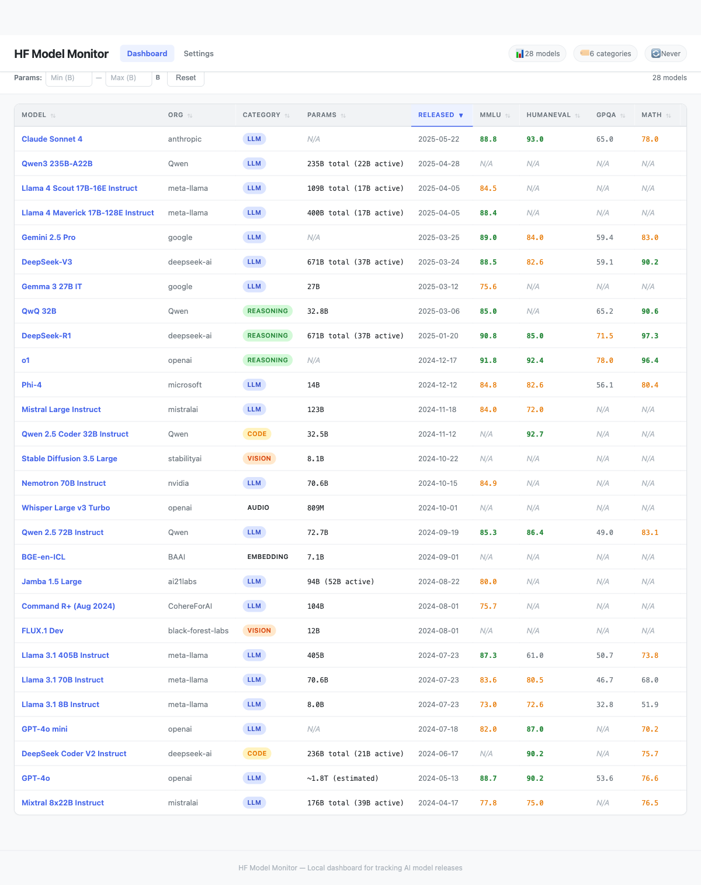
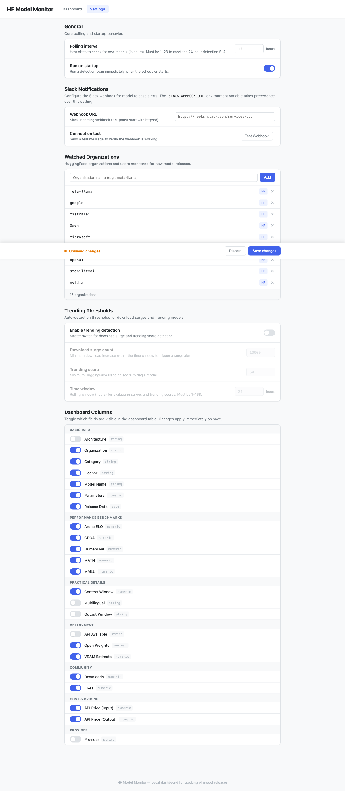

# HF Model Monitor

HuggingFace 신규 AI 모델 출시를 자동 감지하고 Slack으로 리포트를 전송하는 모니터링 시스템.

15개 주요 AI 조직의 모델 릴리스를 추적하며, 벤치마크/가격/비교 테이블을 포함한 구조화된 Slack 알림과 웹 대시보드를 제공합니다.

> **Ralphton 2026** 하네스 세팅 프로젝트 — Ouroboros 자율주행 워크플로우로 구축

**Tech Stack:** Python 3.12 · Flask · SQLite · APScheduler · Slack Block Kit · GitHub Actions

**Stats:** 17개 모듈 · 868개 테스트 · ~23K LOC

---

## 주요 기능

| 기능 | 설명 |
|------|------|
| **신규 모델 감지** | HuggingFace API 폴링으로 15개 조직의 새 모델 자동 탐지. 첫 실행 시 seed model 부트스트랩으로 오탐 방지 |
| **Slack 알림** | Block Kit 구조화 메시지 — 필수 7개 필드 + 벤치마크(MMLU, HumanEval, GPQA, MATH, Arena ELO) + 가격 + 레퍼런스 모델 비교 테이블 |
| **웹 대시보드** | 정렬/필터/검색 가능한 모델 테이블. 카테고리·조직·파라미터 크기 필터, 모델 상세 모달 |
| **설정 관리 UI** | 모니터링 조직 CRUD, 폴링 주기, Slack webhook, 트렌딩 임계치, 컬럼 가시성 — 변경 즉시 YAML 저장 |
| **트렌딩 감지** | 다운로드 급증/트렌딩 스코어 기반 서지 감지 (설정으로 on/off) |
| **스케줄러** | APScheduler 기반 1~23시간 주기 폴링, sub-24h SLA 보장, 런타임 주기 변경 지원 |
| **에러 처리** | 9개 카테고리 에러 분류, Slack 에러 알림, 지수 백오프 재시도 |
| **CI/CD** | GitHub Actions daily cron (09:00 KST), Render 배포 지원 |

### 대시보드



### 설정 페이지



---

## 아키텍처

```
HuggingFace API
      │
  hf_client.py ──▶ detector.py ──▶ model_store.py (SQLite)
                        │
               metadata_collector.py
                        │
               slack_notifier.py ──▶ Slack
                        │
                  dashboard.py ──▶ Browser
```

| 모듈 | 역할 |
|------|------|
| `main.py` | CLI 진입점, 파이프라인 오케스트레이션 (감지→메타데이터→Slack) |
| `config.py` | YAML 설정 로드/저장, 조직 CRUD, 유효성 검증 |
| `detector.py` | 핵심 감지 엔진 — API 결과 vs SQLite 상태 비교 |
| `hf_client.py` | HuggingFace API 클라이언트 (페이지네이션, 레이트 리밋, 파생 모델 필터링) |
| `metadata_collector.py` | 모델 메타데이터 수집/구조화 (벤치마크, VRAM 추정) |
| `model_store.py` | SQLite 저장소 (WAL 모드, upsert, 마이그레이션) |
| `slack_notifier.py` | Block Kit 포맷팅, 웹훅 전송, 비교 테이블, 에러 알림 |
| `scheduler.py` | APScheduler 래퍼, SLA 모니터링, 시그널 핸들링 |
| `trending_detector.py` | 다운로드 급증/트렌딩 스코어 서지 감지 |
| `dashboard.py` | Flask 웹 앱 (모델 테이블, 설정 API, 필터 옵션) |
| `errors.py` | 에러 분류 체계 (9개 CrawlerErrorCategory) |
| `seed_data.py` / `seed_models.py` | 부트스트랩용 사전 데이터 로드 |

---

## 시작하기

### 설치

```bash
pip install -r requirements.txt
```

### 로컬 실행

```bash
# 원샷 감지 (1회 실행 후 종료)
python -m hf_model_monitor --once

# 스케줄러 모드 (지속 폴링)
python -m hf_model_monitor --schedule

# 웹 대시보드
python -m hf_model_monitor.dashboard --port 5001
```

Slack 알림을 받으려면 환경변수 설정:
```bash
export SLACK_WEBHOOK_URL="https://hooks.slack.com/services/..."
```

### GitHub Actions

`.github/workflows/model-monitor.yml`이 매일 00:00 UTC (09:00 KST)에 실행됩니다.

1. GitHub repo Settings → Secrets → `SLACK_WEBHOOK_URL` 등록
2. Actions 탭에서 수동 실행 (Run workflow) 가능

### Render 배포

`render.yaml`이 포함되어 있어 Render에서 바로 배포 가능:

1. [Render Dashboard](https://dashboard.render.com) → New Web Service
2. GitHub repo 연결 → `render.yaml` 자동 감지
3. Environment variable에 `SLACK_WEBHOOK_URL` 추가

### 테스트

```bash
pytest tests/ -v   # 868 tests
```

---

## 랄프톤 2026 하네스 세팅 로그

이 프로젝트는 **Ouroboros 자율주행 워크플로우**의 하네스 세팅 검증을 위해 만들어졌습니다. 아래는 자율주행으로 처리된 부분과 수동 개입이 필요했던 부분의 기록입니다.

### Ouroboros 자율주행 내역

#### 1단계: 소크라틱 인터뷰 (9라운드)

| 라운드 | 질문 주제 | 모호성 |
|--------|-----------|--------|
| 1 | 감시 대상 모델 범위 정의 | 87% |
| 2 | 6개 카테고리 데이터 수집 범위 | 74% |
| 3 | 폴링 방식 (주기적 vs 온디맨드) | 66% |
| 4 | AI 분석 필요 여부 (Contrarian 모드) | 55% |
| 5 | 성공 기준 정의 | 45% |
| 6 | 배포 환경 (Simplifier 모드) | 37% |
| 7 | 리포트 형식 (비교 테이블) | 27% |
| 8 | 폴링 주기 확정 | 21% |
| 9 | 비교 대상 모델 확정 | **15%** |

인터뷰를 통해 초기 "HF에서 모델 트래킹하는 슬랙봇" 수준의 아이디어가 구체적인 스펙으로 진화했습니다. 특히 4라운드의 Contrarian 모드("AI 분석 없이 raw 데이터만으로 충분하지 않나?")가 스펙 범위를 명확히 하는 데 효과적이었습니다.

#### 2단계: Seed 스펙 생성

인터뷰 결과물에서 자동으로 Seed YAML을 생성. Goal, Constraints, Acceptance Criteria, Ontology Schema가 포함된 실행 가능한 명세.

#### 3단계: 3회 실행 (Execution)

| 실행 | 생성 내역 | 결과 |
|------|-----------|------|
| 1차 | 코어 모듈 13개 (hf_client, detector, model_store, slack_notifier, config, errors 등) | 858 테스트 통과 |
| 2차 | 대시보드 + 설정 UI (dashboard.py, templates 2개, CSS 1개, JS 2개) | UI 렌더링 정상 |
| 3차 (Fix Run) | 8개 AC — 테스트 커버리지 추가, config 리버트, workflow 수정 | 8/8 AC 통과, 868 테스트 |

**자율 생성 결과물:** 17개 Python 모듈, 2개 HTML 템플릿, 1개 CSS, 2개 JS, 858개 테스트 (~21K LOC)

**특히 잘 된 것:**
- 각 모듈의 docstring, 타입 힌트, 에러 처리가 일관적
- 테스트 커버리지가 높음 (모듈당 평균 50+ 테스트)
- config 유효성 검증이 꼼꼼 (org name 패턴 regex, 범위 클램핑, 타입 체크)
- Slack Block Kit 포맷팅이 상세하고 구조적
- SQLite WAL 모드, 마이그레이션 지원 등 프로덕션 레벨 설계

### 수동 개입 내역

| 항목 | 원인 | 수정 내용 |
|------|------|-----------|
| **파이프라인 와이어링** | 각 모듈은 잘 만들었지만 end-to-end 흐름 연결 코드가 없었음 | `main.py`에 `_notify_new_models()` 추가, `scheduler.py`에 알림 연동 |
| **`__main__.py` 누락** | `python -m` 실행 진입점이 스펙에 없어서 생성 안 됨 | 3줄짜리 `__main__.py` 작성 |
| **GitHub Actions 버그** | `seen_models.json` → `model_store.db` 마이그레이션 후 잘못된 파일 참조 | `git add -f ... \|\| true`로 방어 코드 추가 |
| **`_build_hf_url` 버그** | seed_data의 `model_id`가 top-level인데 `basic.model_id`만 확인 | top-level `model_id` fallback 추가 |
| **Render 배포 설정** | 배포 인프라가 스펙 scope 밖 | `render.yaml`, gunicorn 추가 |
| **GitHub Secret 등록** | 인프라 작업은 본질적으로 수동 | `gh secret set` 실행 |
| **UI 검증** | 시각적 확인 필요 | Playwright로 대시보드/설정 페이지 브라우저 테스트 |

**핵심 패턴:** Ouroboros는 모듈 단위 생성에 강하지만, **모듈간 integration**과 **배포/CI** 영역은 수동 개입이 필요했습니다.

---

## 레슨런

### 1. 인터뷰가 품질을 결정한다

9라운드 인터뷰로 모호성을 87% → 15%로 줄인 것이 이후 3회 실행의 품질 기반이 됐습니다. Contrarian/Simplifier 모드가 스펙 과팽창을 방지하고 현실적인 범위를 잡는 데 효과적이었습니다. 인터뷰를 건너뛰면 실행 결과물이 방향을 잃습니다.

### 2. 모듈 단위 생성 ≠ 시스템 통합

개별 모듈을 높은 품질로 생성하지만, 모듈간 end-to-end 파이프라인 연결은 스펙에서 명시적으로 기술해야 합니다. "detector가 새 모델을 찾으면 metadata_collector로 보강하고 slack_notifier로 전송" 수준의 **integration 시나리오**를 AC에 포함시켜야 합니다.

### 3. 실행 진입점은 스펙에 명시

`__main__.py`, CLI 인터페이스, 환경변수 처리 등 "글루 코드"는 기능적으로 사소하지만, 스펙에 없으면 생성되지 않습니다. AC에 "python -m으로 실행 가능" 같은 항목을 넣으면 됩니다.

### 4. CI/CD는 별도 영역

GitHub Actions, Render 배포, Secret 관리 등은 Ouroboros scope 밖입니다. 별도 스펙이나 수동 작업으로 계획해야 합니다. 첫 CI 실행은 반드시 직접 확인해야 합니다.

### 5. 데이터 소스 다양성에 주의

seed_data(사전 수집 JSON)와 API response의 스키마가 다를 때 `model_id` 위치 같은 미묘한 차이로 버그가 발생합니다. 스펙에 데이터 흐름의 입출력 스키마를 명시하면 방지 가능합니다.

### 6. 테스트 858개 = 수동 개입의 안전망

수동으로 main.py를 수정한 후 868개 전체 테스트를 1초 내에 확인할 수 있었습니다. Ouroboros가 생성한 높은 테스트 커버리지가 수동 개입의 리스크를 크게 줄였습니다.

### 7. 시각적 검증은 자동화 한계

Slack Block Kit 렌더링, 대시보드 레이아웃은 결국 눈으로 확인해야 합니다. Playwright 브라우저 테스트가 유용하지만 "이 UI가 보기 좋은가?"는 사람이 판단해야 합니다.

---

## 다음에 수정이 필요한 부분

- [ ] **통합 테스트 추가**: end-to-end 파이프라인 (감지→메타데이터→Slack) 통합 테스트
- [ ] **대시보드 인증**: 배포 시 Basic Auth 또는 OAuth 추가
- [ ] **설정 변경 실시간 반영**: scheduler restart 없이 settings.yaml 변경 반영
- [ ] **metadata_collector 강화**: HF API 호출 시 N/A 반환 케이스 에러 핸들링/fallback
- [ ] **seed_data.json 자동 갱신**: 주기적 갱신 스크립트 또는 API 연동
- [ ] **모니터링/관측성**: health check endpoint, 에러 비율 메트릭
- [ ] **Ouroboros 스펙 개선**: 모듈간 호출 흐름(integration scenario)과 실행 진입점을 AC에 포함
- [ ] **대시보드 링크 연결**: Render 배포 후 `dashboard_base_url` 설정으로 Slack 리포트에 대시보드 링크 포함

---

## 모니터링 대상 조직

meta-llama · google · mistralai · Qwen · microsoft · deepseek-ai · openai · stabilityai · nvidia · alibaba-nlp · apple · CohereForAI · bigscience · EleutherAI · tiiuae

`config/settings.yaml` 또는 웹 설정 페이지에서 추가/삭제 가능.
